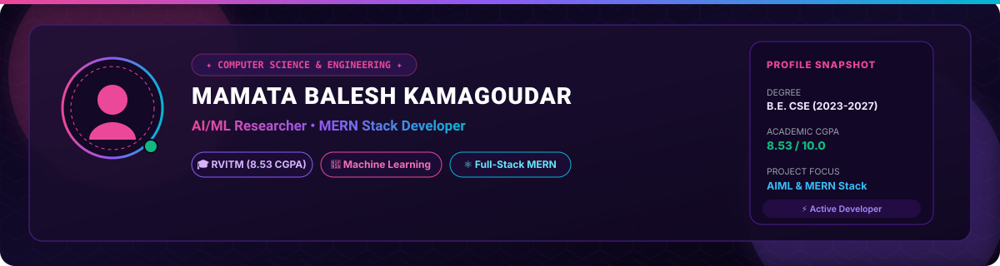

<!-- 
================================================================
  MAMATA BALESH KAMAGOUDAR - FUTURISTIC CYBER PROFILE
================================================================
-->

  <!-- TOP BADGES & COUNTER (No GitHub Actions required) -->
  

    
  

  <!-- FUTURISTIC BANNER (Static SVG - No GitHub Actions required) -->
  

    

  <!-- DYNAMIC TYPING SVG -->
  

    

  <!-- PROMINENT CONNECT BADGES -->
  

    
    &nbsp;
    
  

 

<!-- ABOUT & EDUCATION GRID -->
## 🔮 Profile Overview & Academic Journey

  <table width="100%" fill="none" style="border: 1px solid #3b1d6e; border-radius: 12px; background-color: #0f0720;">
    <tr>
      <td padding="20px">
        <h3>👋 Hello & Welcome! I'm Mamata Balesh Kamagoudar</h3>
        

          I am a <b>Computer Science & Engineering student</b> with a passion for <b>Artificial Intelligence, Machine Learning, and Full-Stack MERN Web Development</b>. My technical drive centres on building scalable web applications and conducting cutting-edge research in <b>Graph Neural Networks (GNN)</b>, <b>Knowledge Graphs</b>, and <b>Agentic AI Workflows</b>.
        

        

        <h4>🎓 Academic Background & Highlights</h4>
        
🏛️ <b>Institution:</b> RV Institute of Technology And Management, Bengaluru - 560083

        
📜 <b>Degree:</b> B.E. in Computer Science and Engineering

        
📅 <b>Timeline:</b> August 2023 – June 2027

        
📊 <b>Academic CGPA:</b> <mark style="background-color: #ec4899; color: white; padding: 2px 8px; border-radius: 4px;"><b>8.53 / 10.0</b></mark>

      </td>
    </tr>
  </table>

 

<!-- SKILLS SHOWCASE -->
## ⚡ Tech Stack & Core Competencies

| Skill Domain | Technologies & Frameworks |
| :--- | :--- |
| **💻 Programming Languages** | `Java` `Python` `JavaScript` `C` |
| **🌐 Web Technologies** | `MERN Stack` `React.js` `Node.js` `Express.js` `MongoDB` |
| **🤖 AI & Machine Learning** | `Machine Learning` `Artificial Intelligence` `GNN & Knowledge Graphs` `RAG Summarization` |
| **🛠️ Tools & Environments** | `VS Code` `Git` `Eclipse IDE` `Jupyter Notebooks` |
| **🧠 Core CS Subjects** | `OOP's` `DBMS` `Operating Systems` |
| **✨ Professional Soft Skills** | `Communication` `Leadership Qualities` |

 

<!-- FEATURED PROJECTS SHOWCASE -->
## 🚀 Featured Projects Showcase

> Highlighting impactful projects across Full-Stack Web Development, Machine Learning, and AI Agents.

 

### 1. 🎓 **RANK2COLLEGE**
> **KCET Rank Predictor & Engineering College List Generator**  
> • *Tech Stack:* `Python`, `Web Dev`, `KCET Analytics`  
> • *Summary:* Helps engineering aspirants select optimal colleges based on KCET rank data.  
> • 🔗 **[Explore GitHub Repository](https://github.com/Mamatak16/KCET_Rank_Predictor_CollegeList_Generator)**

---

### 2. 📅 **Smart Timetable Assistant** *(Worked under Capabl)*
> **Automated Scheduling & Timetable Planner**  
> • *Tech Stack:* `MERN Stack`, `Scheduling Algorithms`  
> • *Summary:* Intelligent web assistant built during the Capabl program for automated timetable generation.  
> • 🔗 **[Explore GitHub Repository](https://github.com/Mamatak16/Smart-Time-Table-Assistant)**

---

### 3. 🏠 **AIML - California House Price Prediction**
> **Predictive Real Estate Valuation Model**  
> • *Tech Stack:* `Python`, `Scikit-Learn`, `AIML Regression`  
> • *Summary:* Machine learning regression framework predicting house values based on census datasets.

---

### 4. 📝 **RAG - Meeting Summariser**
> **AI-Powered Retrieval-Augmented Generation Tool**  
> • *Tech Stack:* `RAG`, `LLMs`, `Python`, `NLP`  
> • *Summary:* RAG system designed for multi-speaker meeting audio processing and concise summary generation.

---

### 5. 📈 **Market Trends Research Agent**
> **Autonomous Market Intelligence Agent**  
> • *Tech Stack:* `Agentic AI`, `LLM Tooling`, `Python`  
> • *Summary:* Autonomous agent that crawls web sources to analyze emerging industry technology trends.

---

### 6. 🌾 **Recommendation System Based on GNN & KG in Agricultural Field**
> **Deep Tech AgriTech Recommendation Engine**  
> • *Tech Stack:* `Graph Neural Networks (GNN)`, `Knowledge Graphs`, `PyTorch`  
> • *Summary:* Advanced graph-based recommendation system tailoring agricultural crop strategies.

 

<!-- COURSES & CERTIFICATIONS -->
## 📜 Courses & Certifications

- 🤖 **Machine Learning with Python Internship** — *EISystems Services*
- 🌐 **Cisco Networking Basics** — *Cisco Networking Academy*
- ⚡ **Capabl Agentic AI Saksham Workshop** — *Capabl*
- 🧠 **Generative AI Workshop** — *Ethical Edufabrica at IISc Bengaluru*
- 🏆 **Certificate of Participation** — *“Hacker-ring” Hackathon*
- 🔐 **Cyber Security And Ethical Hacking** — *Professional Certification*
- 💻 **The Web Developer Bootcamp 2026** — *(Ongoing)*

 

<!-- CONTRIBUTION GRAPH (Static file - No GitHub Actions required) -->
## 🐍 Contribution Graph

  

 

<!-- PHILOSOPHY & FOOTER -->

  <blockquote align="center">
    <i>"Building intelligent full-stack solutions at the intersection of AI, Web Technologies & Graph Machine Learning."</i> 
    <b>— Mamata Balesh Kamagoudar</b>
  </blockquote>
   
  
Crafted with 💜 by <b>Mamata Balesh Kamagoudar</b>

  

